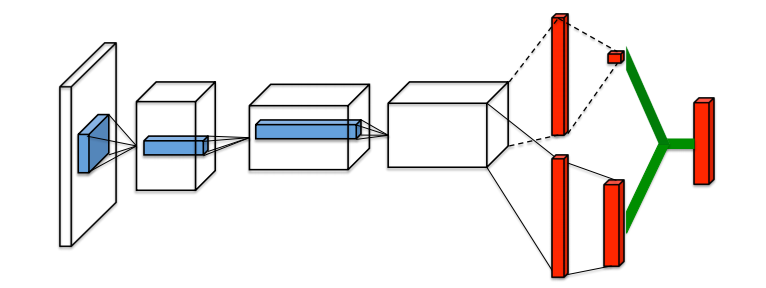

# 强化学习简介

与有监督学习和无监督学习相比，强化学习要解决的是序列决策问题，智能体需要不断地与环境进行交互，不断试错，从而学习到最优策略，使其平均收益最大化。因此，对于试错成本较高的行业，需要先建立一个仿真环境，智能体与仿真环境进行交互学习到最优策略，然后再去适应真实环境。相较于工业界复杂的环境，游戏拥有天生的真实环境，因此当下的强化学习在游戏领域应用最多。

## 强化学习框架

### 马尔可夫决策过程(MDP) 

**定义2.1：** 马尔可夫决策过程可被元祖$\langle \mathbb{S},\mathbb{A},P,R,\gamma \rangle$中关键元素所描述。

- $\mathbb{S}：$ 环境状态空间。
- $\mathbb{A}：$ 智能体可能的动作空间。
- $P:\mathbb{S}\times\mathbb{A}\to\Delta(\mathbb{S})：$ 在时刻$t$时，基于智能体的动作$a\epsilon\mathbb{A}$，在下一时刻，环境由状态$s\epsilon\mathbb{S}$转换到${s}'\epsilon\mathbb{S}$的概率。
- $R:\mathbb{S}\times\mathbb{A}\times\mathbb{S}\to\mathbb{R}：$ 表示奖励函数，即智能体采取动作$a$后，环境从状态$s$转换到状态${s}'$，返回一个标量值。奖励的绝对值有界于$R_{max}$。
- $\gamma\epsilon[0,1]：$ 折扣系数，用于决定智能体对未来奖励的重视程度。

在强化学习中，智能体的学习目标是寻找到期望累计折扣奖励最大化的**最优策略**。如式2.1所示，最优策略引导智能体采取序列行动，从而最大化累计折扣回报。马尔可夫决策过程具有马尔可夫性，即状态$s_t$取决于上一时刻状态$s_{t-1}$，而与历史状态$s_{i<(t-1)}$无关。但是，$a_t$不仅仅影响$s_{t+1}$，也对未来的状态和奖励产生影响。
$$
\begin{equation}
\mathbb{E}\_{s\_{t+1}\sim P(\cdot|s\_t,a\_t)}\begin{bmatrix}\sum\_{t\ge0}\gamma ^{t}R(s\_t,a\_t,s\_{t+1})\vert a\_t\sim\pi(\cdot\vert s\_t),s\_0\end{bmatrix}\tag{2.1}
\end{equation}
$$
在策略$\pi$下，基于目标函数(2.1)，可以定义状态-动作的价值函数$Q(s,a)$和状态的价值函数$V(s)$为：
$$
\begin{equation}
Q^{\pi}(s,a)=\mathbb{E}^{\pi}\begin{bmatrix}\sum\_{t\ge0}\gamma^tR(s\_t,a\_t,s\_{t+1}\vert a\_0=a,s\_0=s)\end{bmatrix},\forall s\epsilon \mathbb{S},a\epsilon \mathbb{A}\tag{2.2}
\end{equation}
$$

$$
\begin{equation}
V^{\pi}(s)=\mathbb{E}^{\pi}\begin{bmatrix}\sum\_{t\ge0}\gamma^tR(s\_t,a\_t,s\_{t+1}\vert s\_0=s)\end{bmatrix},\forall s\epsilon \mathbb{S}\tag{2.3}
\end{equation}
$$

价值函数与Q函数，有如下关系：

$V^{\pi}(s)=\mathbb{E}\_{a\sim\pi(\cdot\vert s)}\begin{bmatrix}Q^{\pi}(s,a)\end{bmatrix}$

$Q^{\pi}=\mathbb{E}\_{{s}'\sim \pi(\cdot\vert s)}\begin{bmatrix}R(s,a,{s}')+V^{\pi}({s}')\end{bmatrix}$

 对于智能体来说，只要奖励函数和状态转换函数均具有马尔可夫性和静态性，那么最优策略一定存在。

### 部分可观测马尔可夫决策过程(POMDP)

若智能体所处的环境状态为不完全可知，那么该环境为部分可观测。因此，该场景下的强化学习框架变为部分可观测马尔可夫环境。

**定义2.2：** 部分可观测马尔可夫决策过程可被元祖$\langle \mathbb{S},\mathbb{A},P,R,\gamma,\mathbb{O},O \rangle$所描述。除了MDP定义中元素之外，其余的元素含义如下：

- $\mathbb{O}：$ 智能体的观测集合。
- $O:\mathbb{S}\times\mathbb{A}\to\Delta(\mathbb{O})：$ 表示的是观测函数$O(o\vert a,{s}')$ ，给定动作$a\epsilon \mathbb{A}$和环境状态转换后的新状态${s}'\epsilon \mathbb{S}$，观测$o\epsilon \mathbb{O}$的概率分布。

智能体的策略变为$\pi:\mathbb{O}\to\Delta(\mathbb{A})$。

## 马尔可夫决策过程的解方法

马尔可夫决策过程的求解方法有：蒙特卡罗树搜索、动态规划、及强化学习等。其中，强化学习是一种近似最优的方法，对于经常出现的状态能学习出较好的决策，对于不经常出现的状态往往学习力度不够。接下来，介绍一下常见强化学习算法。

### 基于值的方法

#### DQN

DQN为深度强化学习的开篇之作，该算法基于深度神经网络作为Q-Learning的函数近似器，从而形成Deep Q Learning。根据论文，可知，非线性神经网络用作Q-Learning算法的函数近似器，往往产生学习不稳定的现象。学习不稳定主要由状态观测序列之间的相关性、Q函数值与其目标值之间的相关性造成。为了解决观测序列相关造成学习不稳定的现象，基于**经验回放**方法随机化数据，从而移除观测数据之间的相关性并平滑数据分布；为了解决Q函数值与其目标值之间的相关性，Q函数分为**学习网络**和**目标网络**，且学习网络迭代方式更新、目标网络周期性更新。

#### Double DQN

若Q-Learning算法因环境的噪声而对状态-动作(s,a)估计有误差，那么很有可能产生高估的现象，这是因为Q函数的目标值为$Q(S_{t+1},argmax_{a}Q(S_{t+1},a;\theta_{t}){\theta}'_{t})$。

在降低Q函数高估的算法中，Double Q-Learning是基于学习网络选择$a_{t+1}$，基于目标网络估计$Q(S_{t+1},a_{t+1})$，可参见式(1)。
$$
Y_t=R_{t+1}+\gamma Q(S_{t+1},argmax_{a}Q(S_{t+1},a;\theta_{t}){\theta}'_{t})
$$
这种动作选择和值估计的区分既满足了Q-Learning中贪心选择动作，又降低了高估的可能性。

与DQN一致，Double DQN是基于深度神经网络为Double Q-Learning的函数近似器。实验证明，Q函数高估的确会阻碍学习。然而，若价值函数高估为智能体面对不确定性的估计，则有利于智能体对环境进行探索，进而学习出更优的策略。

#### Prioritized Replay

#### Dueling Network

相较于DQN、Double DQN、以及Prioritized Replay，Dueling Network是强化学习网络架构上的创新。在实践中，发现，Dueling Network算法的表现性能是最好的。Dueling Network网络架构由两个部分组成，分别为状态价值函数$V(s\_t)$预测部分和优势函数函数$A(s\_t,a\_t)$预测部分，以上两个函数近似器底层共享一个卷积模块，用于特征学习。该网络架构背后的思想是：存在状态$s_t$，不需要估计状态-动作$(s_t,a_t)$的价值。如图2.1所示，Dueling Network的网络架构。

    图2.1 Dueling-network 网络架构

#### Rainbow

### 基于策略的方法

#### 策略梯度理论

#### REINFORCE

#### TRPO

### PPO

### Actor-Critic算法

#### A2C

#### A3C

#### SAC

## 挑战

## 参考文献

[1] Yang Y ,  Wang J . An Overview of Multi-Agent Reinforcement Learning from Game Theoretical Perspective[J].  2020.
