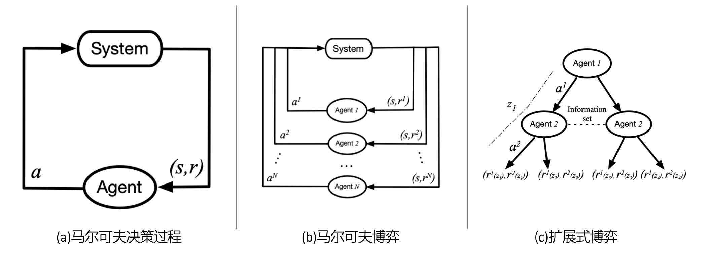
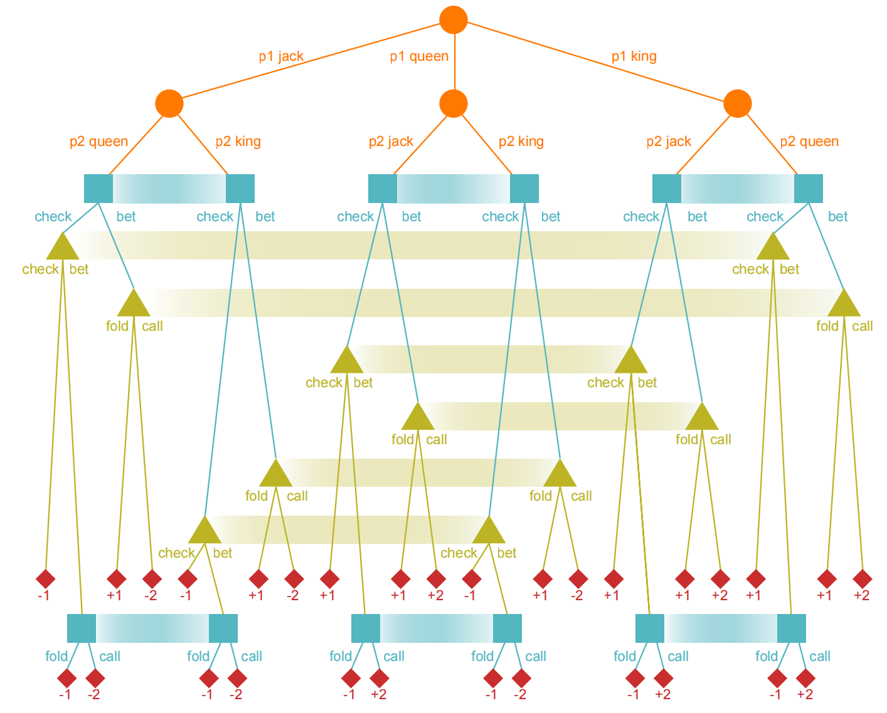

# 多智能体强化学习简介

## 多智能体强化学习框架

单智能体强化学习的框架为马尔可夫决策过程(Markov Decision Process)，而多智能体强化学习的框架有两种，分别为随机博弈(Stochastic Game)和扩展式博弈(Extensive-form Game)。如图4.1所示，学习框架。

    图4.1 学习框架

### 随机博弈

随机博弈(Stochastic Game)，也可以被称为**马尔可夫博弈**(Markov Game)，是马尔可夫决策过程(Markov Decision Process)的直接泛化，可以捕获智能体之间联系。接下来，引入随机博弈的正式定义。

**定义4.1：** 一个随机博弈可以视为马尔可夫决策过程(MDP)在多智能体领域的扩展形式。因此，随机博弈可以被关键元素$\langle N,\mathbb{S},\{\mathbb{A}^i\}\_{i\epsilon\\{1,\ldots,N\\}},P,{R^i}\_{i\epsilon\\{1,\ldots,N\\}},\gamma\rangle$定义。

- $N$：智能体个数$\left(N\ge2\right)$。
- $\mathbb{S}$：所有智能体共享的环境状态集合。
- $\mathbb{A}^i$：智能体$i$的动作集合.其中，智能体的联合动作集合为$\mathbf{A}:=\mathbb{A}^1\times\cdots\times\mathbb{A}^N$。
- $P:\mathbb{S}\times\mathbf{A}\to\Delta\left(\mathbb{S}\right)$：表示在$t\epsilon N$时刻，给定智能体的联合动作$\mathbf{a}\epsilon\mathbf{A}$，下一时刻，环境从状态$s\epsilon\mathbb{S}$转换到${s}'\epsilon\mathbb{S}$的概率。
- $R^i:\mathbb{S}\times\mathbf{A}\times\mathbb{S}\to\mathbb{R}$：表示对于从$\left(s,\mathbf{a}\right)$到${s}'$的转换，奖励函数返还给智能体$i$一个标量值，即为奖励。
- $\gamma\epsilon\begin{bmatrix}0,1\end{bmatrix}$：折扣系数。

在时间为$t$时，智能体$i \epsilon N$在环境状态为$s_t$，执行动作$a_t^{i}$后，环境的状态转变为$s_{t+1}$，并且智能体$i$获得奖励$R^i(s_t,a_t,s_{t+1})$。智能体$i$通过找到策略$\pi^i:\mathbb{S}\to \Delta(\mathbb{A}^i)$优化自己的长期目标，其中动作$a_t^i \sim \pi^i(\cdot|s_t)$。由于所有智能体共同行动，且共同获得奖励，那么智能体$i$的价值函数$V^i :\mathbb{S}\to R^{i}$是联合策略$\pi:\mathbb{S}\to \Delta(\mathbb{A})$的函数。其中，联合策略被定义为$\pi(a|s):=\prod _{i\epsilon N}\pi^{i}(a^i|s)$。即$\forall \pi$, $\forall s\epsilon \mathbb{S}$，

$$
\begin{equation}
V^i_{\pi^i,\pi^{-i}}(s):=E[\sum_{t\ge 0}\gamma^t R^i(s_t,a_t,s_{t+1})|a_t^i\sim \pi^i(\cdot|s_t),s_0=s] \tag{3.1}
\end{equation}
$$

其中，$-i$代表除$i$外所有智能体。由于智能体$i$的最优表现不仅仅被自己的策略控制，而且被除自身外所有智能体控制。因此，MG(Markov Game)的**解概念**(Solution Concept)与MDP有所不同，最常用的是纳什均衡(Nash Equilibrium)。

#### 随机博弈的特殊形式

### 扩展式博弈

在随机博弈中，每个阶段都可以被一张大表所表示，表中的行和列对应于两个玩家的行动。基于这张大表，随机博弈可以建模的场景是玩家同时行动和同时收到奖励。然而，对于真实世界的许多博弈，玩家交替采取行动，例如：扑克就是一种具有先发优势的博弈。智能体(玩家)可以交替采取行动的博弈被描述为**扩展式博弈**(Extensive-form game)，该博弈可通过树结构展示。

如图4.2展示了两个玩家库恩扑克的博弈树。在库恩扑克中，发牌商有三张卡片，分别是：King、Queen、Jack(King>Queen>Jack)，每个玩家都会收到一张卡片(图5.2中橘色节点)。与此同时，第三章卡片会放到旁边，不允许被看。

  图4.2 库恩扑克博弈树

注释：每个节点(圆圈、正方形、三角形)表示一个玩家的选择，每个边表示一个可能的行动，叶子表示最终的结果，玩家各有一个奖励函数(只有一个玩家的奖励被展示，这是因为库恩扑克为零和博弈)。每个玩家仅仅能观测到自己的卡片，例如：当玩家一手中一张Jack时，它不能告诉玩家二，它手中是Queen还是King。

对于多玩家(智能体)决策，扩展式博弈(EFGs)的一个重要特征是可以建模**不完美信息**。例如：库恩扑克中玩家不知对手有什么牌。虽然Dec-POMDP也可以建模不完美信息场景，但是难以求解。在同一个序列形式中，与Dec-POMDP不一样，EFG能够在多项式时间内被线性规划(Linear Programing)解决。接下来，首先引入扩展式博弈，然后引入扩展式博弈的序列形式。

**定义4.2：**  一个扩展式博弈可以被关键元素$\langle N,\mathbb{A},\mathbb{H},\{R^i\}_ {i\epsilon\\{1,\ldots,N\\}},\chi,\rho,P,\{\mathbb{S}^i\}_ {i\epsilon\\{i,\ldots,N\\}} \rangle$所描述。

- $N$：智能体的数量。一些扩展式博弈包含一个特殊的智能体 ，被成为"chance"，该智能体拥有一个固定的随机策略，用于表示环境的随机性。
- $\mathbb{A}$：所有智能体可能动作的集合。
- $\mathbb{H}$：非终止选择节点集合。
- $\mathbb{T}$：终止选择节点集合，脱离于$\mathbb{H}$。
- $\chi:\mathbb{H}\to2^{\vert\mathbb{A}\vert}$：为每个选择节点分配动作的动作函数。
- $\rho:\mathbb{H} \to \\{1,\ldots,N\\}$：智能体的身份函数，为非终止节点分配一个在该节点选择动作的智能体。
- $P:\mathbb{H}\times\mathbb{A}\to\mathbb{H}\bigcup\mathbb{T}$：把一个选择节点和一个动作映射到一个新选择节点或终止节点的转换函数，以便于$\forall h_ 1,h_ 2\epsilon\mathbb{H}$和$\forall a_ 1,a_ 2\epsilon \mathbb{A}$，若$P(h_ 1,a_ 1)=P(h_ 2, a_ 2)$，则$h_ 1=h_ 2$且$a_ 1=a_ 2$。
- $R^i:\mathbb{T}\to\mathbb{R}$：为玩家$i$在终止节点的奖励函数，其函数值为实数。
- $\mathbb{S}^i$：智能体$i$等价类的集合$\mathbb{S}^i=\left(S_ 1^ i,\cdots,S_ {k^ i}^i\right)$。该集合拥有性质为：对于$\forall j\epsilon \\{1,\ldots,k^i\\}$，$\forall h,{h}'\epsilon S_ j^i$，有$\chi(h)=\chi({h}')$和$\rho(h)=\rho({h}')$。集合$S_ j^i$被成为**信息状态**，其物理意义为一个信息状态中选择节点是无法可区分的。换句话说，一个信息状态中选择节点的智能体身份集合和有效行动集合是相同的。因此，对于$\forall h\epsilon S_ j^i$，可用$\chi(S_ j^i),\rho(S_ j^i)$分别表示$\chi(h)$,$\rho(h)$。

为了便于表示，定义一个映射$I:\mathbb{H}\to \mathbb{S}$，若$h\epsilon s$，则$I(h)=s$。在扩展式博弈中，仅仅考虑$\mathbb{H}$和$\mathbb{A}$为有限集合。为了简化概念，对于$\forall h,{h}'\epsilon \mathbb{H}$，若$h$可以从${h}'$采取一系列动作之后到达，那么$h$为${h}'$的前缀，可以表示为$h\subseteq {h}'$，也可以称${h}'$为$h$的一个后缀。此外，在整个博弈过程中，每个智能体能够记住产生当前信息状态的信息序列和动作序列，即完美召回(perfect recall)。**完美召回**使算法能够在多项式时间内解决博弈。在完美召回的假设下，根据Kuhn's theorem，存在一个映射使信息集合$s\epsilon \mathbb{S}$与关于$\mathbb{A}(s)$的概率分布相对应，即行为策略(behavioral policies)存在。

对于$\forall i\epsilon N$，智能体$i$的信息状态集合$\mathbb{S}^i=\\{s\epsilon \mathbb{S}:\rho(s)=i\\}$。智能体的联合策略被表示为$\pi=(\pi^1,\cdots,\pi^N)$，其中$\pi^i:\mathbb{S}\to \Delta(\mathbb{A}(s))$为智能体$i$的策略。对于$\forall{h,\pi}$，可以定义在策略$\pi$下选择$h$的可达概率为
$$
\begin{equation}
\eta_{\pi}(h)=\prod_{{h}':{h}'a\subseteq h}\pi^{\rho({h}')}(a\vert I({h}'))=\prod_ {i\epsilon N}\prod_{{h}':{h}'a\subseteq h,\rho({h}')=i}\pi^{i}(a\vert I({h}')) \tag{3.2}
\end{equation}
$$

式3.2确定了在所有智能体遵从策略$\pi$的情况下，选择节点$h$可达的概率。同理，在策略$\pi$下信息状态$s$的可达概率为$\eta_{\pi}(s)=\sum_{h\epsilon s}\eta_{\pi}(h)$。因此，智能体$i$的奖励期望为$\sum_{t\epsilon \mathbb{T}}\eta_{\pi}(t)\cdot R^i(t)$。

#### 正常形式表示

#### 序列形式表示

## 部分可观测环境下的框架

### 部分可观测随机博弈

部分可观测随机博弈(Partially Observable Stochastic Game)假定智能体不能获取精确的环境状态，只能通过观测函数获取真正状态的一个观测。如下，POMDP的定义为：

**定义4.3:**  一个部分可观测随机博弈可被元祖$\langle N,\mathbb{S},\{\mathbb{A}^i\}\_{i\epsilon\\{1,\ldots,N\\}},P,\{R^i\}\_{i\epsilon\\{1,\ldots,N\\}},\gamma,\{\mathbb{O}^i\}\_{i\epsilon \\{1,\ldots,N\\}},O \rangle$所描述。除了定义3.1中元素外，其它元素的含义如下：

- $\mathbb{O}^i:$  智能体$i$的观测集合。联合观测集合被定义为$\mathbb{O}:=\mathbb{O}^1\times\ldots\times\mathbb{O}^N$。
- $O:S\times\mathbb{A}\to\Delta(\mathbb{O}):$  在给定动作$a\epsilon\mathbb{A}$和环境转换到新状态${s}'\epsilon \mathbb{S}$情况下，观测$o\epsilon \mathbb{O}$的概率分布，即观测函数为$O(o\vert a,{s}')$。

每个智能体的策略变为${\pi}^i\epsilon {\prod}^i:\mathbb{O}\to\Delta(\mathbb{A}^i)$。

###  去中心-部分可观测马尔可夫决策过程(DEC-POMDP)

在真实世界中，虽然环境的部分可观测性很常见，但也提高了随机博弈的求解难度，例如：即便是最简单的两个玩家完全合作的有限窗口博弈，其求解难度仍是NEXP-hard，即最坏情况需要超指数时间求解。然而，基于深度学习的去中心化训练中心化执行方法仍实现了许多实验上的成功。

在大多数博弈中部分可观测随机博弈是最通用的。部分可观测随机博弈的一个重要子类是去中心化部分可观测马尔可夫决策过程(Decentralised Partially Observeable MDP)，其所有智能体共享相同的奖励。

**定义4.4:** 部分可观测马尔可夫决策过程(Dec-POMDP)是部分随机博弈的一个特殊形式，即定义4.3中$R^1=R^2=\cdots=R^N$。

根据定义，可以了解Dec-POMDPs通过部分可观测条件与单智能体的马尔可夫决策过程有关，通过同等奖励假设与随机团队博弈相关(Stochastic Team Games)。换句话说，单智能体的马尔可夫决策过程和随机团队博弈为Dec-POMDPs的特殊形式。

**定义4.5:** 接下来，介绍的博弈是去中心化部分可观测马尔可夫决策过程(Dec-POMDPs)的特殊形式。

- **部分可观测马尔可夫决策过程(POMDP)**: 部分可观测限制下的单智能体马尔可夫决策过程。
- **去中心化马尔可夫决策过程(Dec-MDP)**: 在Dec-MDP中，智能体拥有*联合完全可观测性*。也就是，若所有智能体共享它们的观测，它们的环境状态为完全可观测。在数学上，有$\forall o\epsilon\mathbb{O},\exists s\epsilon\mathbb{S}$以便于$\mathbb{P}(\mathbb{S}\_t=s\vert\mathbb{O}\_t=o)=1$。
- **完全合作场景下的随机博弈**: 假设每个智能体有完全可观测性，即$\forall i=\\{1,\ldots,N\\}$,$\forall o^i\epsilon \mathbb{O}^i,\exists s\epsilon \mathbb{S}$以便于$\mathbb{P}(\mathbb{S}_t=s\vert \mathbb{O}_t=o^i)=1$。该博弈也是随机博弈的一个特殊类型。

## 学习场景

多智能体强化学习常见场景有**完全合作场景**、**完全竞争场景**、**混合场景**。其中，合作场景是指智能体之间处于合作关系；竞争场景是指智能体之间处于竞争关系；混合场景是指智能体之间既有合作关系，也有竞争关系，例如：足球运动中队员之间的关系。

### 合作场景

完全合作场景中，智能体为了实现共同的目标，共享相同的奖励函数，从而协调所有智能体的利益，也即智能体之间具有同质性。在系统演化过程中，这种同质性表现在智能体之间的角色可互换，很难区分彼此。在**马尔可夫博弈框架**下，智能体拥有共同奖励函数的模型，AI社区称其为*multi-agent MDPS*(**MMDPs**)，控制论或博弈论社区称其为*Markov teams/team games*。

在合作场景中，除了拥有共同的奖励函数，智能体之间也可以拥有不同的奖励函数。同时，智能体的合作目标是优化长期奖励对应的平均奖励，也即对于$\forall (s,a,{s}')\epsilon {\mathcal{S},\mathcal{A},\mathcal{S}}$，平均奖励为$\bar{R}(s,a,{s}'):=N^{-1}\cdot \sum_{i\epsilon \mathcal{N}}R^{i}(s,a,{s}')$。这种平均奖励模型允许智能体之间的异质性，也允许智能体保存自己的私有信息。同时，由于异质性的存在，智能体之间需要交流协议，即也促进了去中心化多智能体强化学习算法的发展。

### 竞争场景

完全竞争场景中，智能体之间被建模为**零和博弈**。在零和博弈场景中，一个智能体的奖励就是另一个智能体的损失，也即对于$\forall(s,a,{s}')$，都有$\frac{1}{N}\sum_{i\epsilon N}R^i (s,a,{s}')=0$。在对现实世界进行建模时，为了降低算法分析的难度，该场景下的智能体个数通常只有两个。

### 混合场景

混合场景中，每个智能体是自私自利的，它们的目标和彼此关系无限制。也可以理解为，它们的目标可能会与其它智能体产生冲突，也可能具有相同的目标。在该场景中，**博弈论**中均衡的概念对算法开发有很大的影响，例如：**纳什均衡**。

## 挑战

多智能体强化学习不仅仅面对单智能体强化学习所具有的挑战，也面对自己所具有的挑战。

### 非唯一的学习目标

对于单智能体强化学习来说，它的唯一目标是最大化奖励累积和的平均值(Maximizing the expected value of the cumulatiuve sum of rewards)；而多智能体强化学习的目标是多维度的、模糊不清的。但是，多智能体强化学习的学习目标大致可以分为**稳定性**(stability)和**理性**(rationality)。其中，稳定性是指智能体的性能不会随其它智能体的策略改变而降低，即与其它智能体的策略达到均衡，例如：纳什均衡；理性是指智能体在其它智能体保持静态时，能够拟合到最优策略。

### 非静态的环境

在多智能体强化学习中，智能体是并发进行学习的，对于处于**竞争关系**的智能体之间会影响彼此的奖励、状态的转变；对于处于**完全合作环境**的智能体之间，也会因为环境的**部分可观测性**，智能体会对彼此之间的动作、奖励未知，从而彼此会产生影响，也即是智能体面对的环境是非静态的。

在环境为非静态的情况下，环境不具有**静态马尔科夫性**，也即单个智能体的奖励和面对的状态并不仅仅取决于过去的状态和采取的动作。

### 扩展性问题

为了应对环境的非静态性，每个智能体都需要考虑**联合动作空间**(joint action space)，而联合动作空间随着智能体的个数呈现指数方式的增加。在大量智能体场景中，拟合分析和理论分析会很复杂。对于扩展性问题，一个可能的补救办法是设定与动作有关的值函数或奖励函数的**因式分解结构**(factorized structures)。

### 各种各有的信息结构

智能体在学习和执行时，环境的部分可观测性会加剧非静态引起的问题。其中，环境的部分可观测性是指每个智能体不能完全获取其它智能体的行为信息，最多能够对其它智能体的行为进行采样。由于环境的非静态性，智能体可采取的学习执行方式非单一，从而智能体的信息结构是多种多样的，常见的信息结构分别有**中心化结构**、**网络结构**、**去中心化结构**。其中，去中心化结构的算法常常面临难以收敛的情况。

    图4.3 多智能体的常见信息结构

为了缓和环境部分可观测性造成的非静态问题，如图4.3(a)所示，大量的工作为智能体的学习设定了一个中心化控制器(评论家)，用于收集所有智能体的行动、奖励、动作。这种**中心化结构**的智能体学习和执行方式被称为**中心化学习分布式执行**。

然而，在仿真器容易获取的场景中，才能设定中心化控制器，即大部分场景可采取的信息结构为图4.3(c)所示的**去中心化结构**。为了解决去中心化结构类算法难以收敛的问题，智能体通常被允许与附近的智能体之间**交流**，即信息结构为图4.3(b)所示的**网络结构**。

在训练与执行时，相对于多智能体，单智能体面对的信息只有环境的状态或可观测信息。由此可知，各种各样的信息结构也是多智能体强化学习的挑战之一。

## 算法的类别

若根据MARL工作的**内容**，可以简单分类为：

1. 涌现行为分析
2. 通信学习
3. 合作学习
4. 智能体建模

其中，**涌现行为分析**的工作主要分析和评估单智能体强化学习在多智能体环境中的行为表现，实际上不会提出新的算法；**通信学习**主要探索智能体之间可通过哪种方式进行交流，例如：直接信息、共享记忆；**合作学习**主要研究智能体在合作场景或混合场景中如何进行合作，例如：DQN中经验回放在MARL用于智能体之间的合作；**智能体建模**主要研究智能体如何对其它智能体进行建模，不仅仅可以用于合作，也可以用于竞争，该类算法主要产生于竞争场景和混合场景，例如：通过建模可以推断其它智能体的目标和学习行为。

若根据MARL算法的**学习类型**和**学习场景**，可以分类为：

1. 完全合作场景
   - 同质智能体(Homogeneous Agent)
   - 带有网络结构的去中心化范式(Decentralized Paradigm with Networked Agents)
   - 部分可观测模型(Partially Observed Model)
2. 完全竞争场景
   - 基于策略的方法
   - 基于值的方法
3. 混合场景

根据学习类型和学习场景的算法分类较为繁杂，后面章节会进行详细介绍。

## 博弈论与MARL

博弈论在多智能体强化学习领域占重要的角色，为其提供**解概念**。其中，解概念描述了一次博弈的结果，即表明了智能体最终采取的策略。对于多智能体强化学习，很多类型的解概念运用于该领域。其中，最著名的解概念应该是非合作博弈论中的**纳什均衡**(Nash Equilibrium)。**非合作博弈论**并非指智能体之间只能竞争，它仅仅意味着每个智能体独立的最大化其自身的收益，不能形成联盟做出集体决策。

### 随机博弈的解概念

随机博弈(Stochastic Game)的**解概念**(Solution Concept)与MDP有所不同，最常用的是纳什均衡(Nash Equilibrium)。其定义如下：

**定义4.6：** 一个被表示为$\langle N,\mathbb{S},\{\mathbb{A}^i\}\_{i\epsilon\\{1,\dots,N\\}},P,{R^i}\_{i\epsilon\\{1,\dots,N\\}},\gamma\rangle$的马尔可夫博弈，其纳什均衡为一个联合策略$\pi^{\ast}= ({\pi}^{1,\ast},\cdots ,\pi^{N,\ast})$。在该策略中，对于任何的$s\epsilon S$和$i\epsilon N$，智能体$i$的策略$\pi^i$都有

$V^ {i}_ {\pi^ {i,\ast},\pi^{-i,\ast}}(s)\gt V^ {i}_{\pi^ {i},\pi^{-i,\ast}}(s)$

MARL算法拟合到纳什均衡(Nash Equilibrium)时，对于智能体$i\epsilon N$，策略$\pi^{i,\ast}$为$\pi^{-i,\ast}$的最好响应。对于有限空间和有限窗口的折扣马尔可夫博弈总是存在纳什均衡，但纳什均衡点可能不唯一。

### 扩展式博弈的解概念

与随机博弈的解概念类似，扩展式博弈的解决概念为**纳什均衡**的$\epsilon$近似。

**定义4.7：** 一个被表示为$\langle N,\mathbb{A},\mathbb{H},\\{R^i\\}_ {i\epsilon\\{1,\ldots,N\\}},\chi,\rho,P,\\{\mathbb{S}^i\\}_ {i\epsilon\\{i,\ldots,N\\}} \rangle$的扩展式博弈(EFG)，其$\epsilon - Nash\quad Equlibrium$是一个联合策略$\pi^{\ast}=(\pi^{1,\ast},\cdots,\pi^{N,\ast})$。在该联合策略中，对于$\forall i\epsilon N$，智能体$i$的任何策略$\pi^i$，都有

$R^i(\pi^{i,\ast},\pi^{-i,\ast})\ge R^i(\pi^i,\pi^{-i,\ast})-\epsilon$

## 参考文献

[1] Hernandez-Leal P ,  Kartal B ,  Taylor M E . Is multiagent deep reinforcement learning the answer or the question? A brief survey[J].  2018.

[2] Du W ,  Ding S . A survey on multi-agent deep reinforcement learning: from the perspective of challenges and applications[J]. Artificial Intelligence Review: An International Science and Engineering Journal, 2021(5):54.

[3] Zhang K ,  Yang Z ,  Baar T . Multi-Agent Reinforcement Learning: A Selective Overview of Theories and Algorithms[J]. Springer, Cham, 2021.

[4] Yang Y ,  Wang J . An Overview of Multi-Agent Reinforcement Learning from Game Theoretical Perspective[J].  2020.
